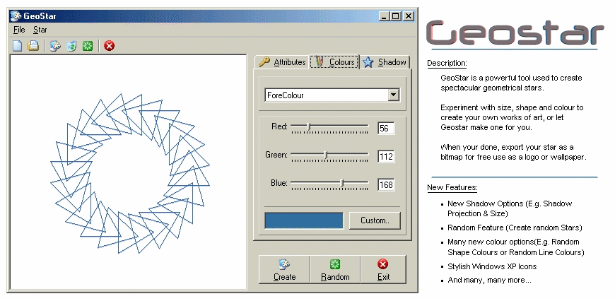



## GeoStar 3\.0 \(\*Final\*\)

### Description

GeoStar 3.0 has many many new improvements, too many to list, so have a look at the screenshot.

A major update is a new interface with cool new XP Icons.

Leave a vote or a comment or something. Thanks
 
### More Info
 

             |
---                |---
**Submitted On**   |2001-11-06 20:19:00
**By**             |[Chris O'Hara](https://github.com/Planet-Source-Code/PSCIndex/blob/master/ByAuthor/chris-o-hara.md)
**Level**          |Intermediate
**User Rating**    |4.6 (32 globes from 7 users)
**Compatibility**  |VB 5\.0, VB 6\.0
**Category**       |[Graphics](https://github.com/Planet-Source-Code/PSCIndex/blob/master/ByCategory/graphics__1-46.md)
**World**          |[Visual Basic](https://github.com/Planet-Source-Code/PSCIndex/blob/master/ByWorld/visual-basic.md)
**Archive File**   |[GeoStar\_3\_335521162001\.zip](https://github.com/Planet-Source-Code/chris-o-hara-geostar-3-0-final__1-28686/archive/master.zip)

